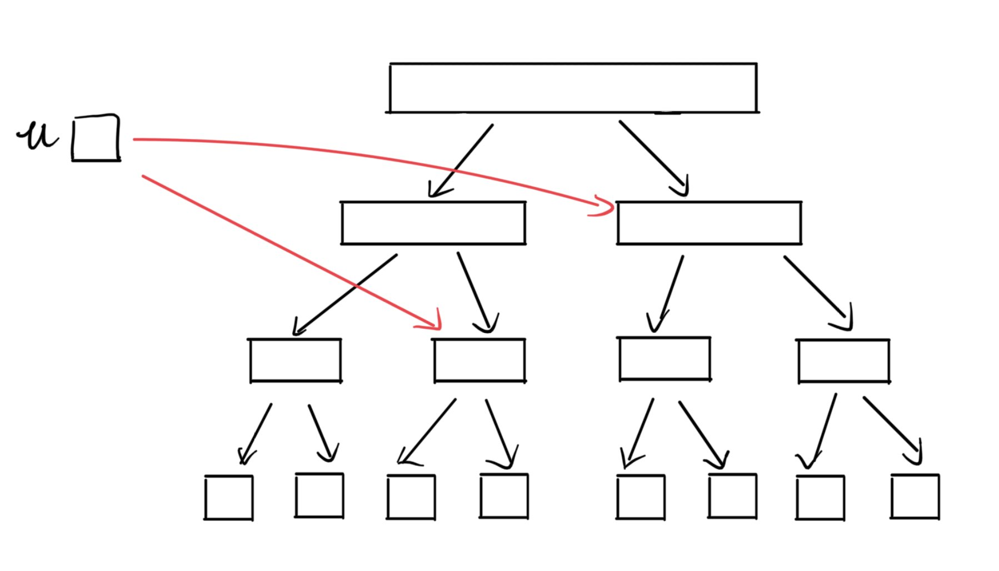
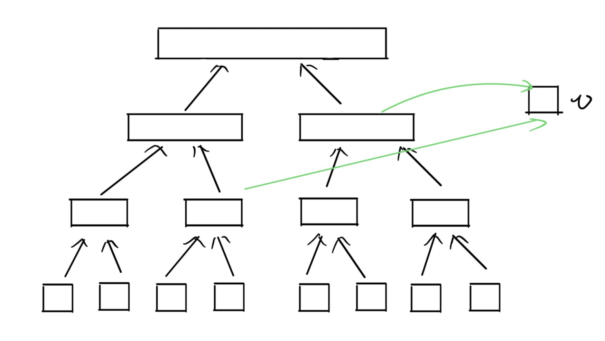
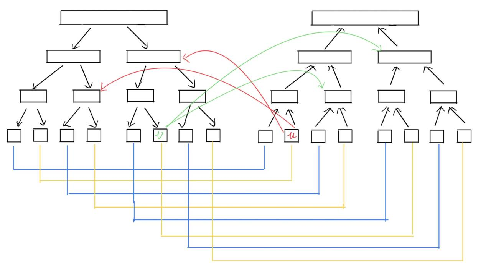

# 线段树优化建图

## 引入

题目传送门：[CF786B - Legacy](https://codeforces.com/problemset/problem/786/B)

题意：给定 $n$ 个点， $q$ 次操作，和一个起点 $s$，需要执行 $q$ 次操作后，输出 $s$ 到所有点的最短距离。每次操作为三种操作中的其中一种：

- `1 u v w`：从 $u$ 向 $v$ 连一条权值为 $w$ 的有向边 ；
- `2 u l r w`：从 $u$ 向 $i \in [l, r]$ 的点，都连一条权值为 $w$ 的有向边；
- `3 l r v w`: 从所有的 $i \in [l, r]$ 的点，都向 $v$ 连一条权值为 $w$ 的有向边。

## 题解

对于操作 $1$ ，我们可以直接建边。但是对于操作 $2$ 和操作 $3$ ，如果我们每次都是暴力建边的话，那么显然会 `TLE`。因此，我们需要 **线段树优化建图**。

> 线段树优化建图，更为具体的来说，因为建图连边过程中出现一些性质，例如区间加边，这时候可以利用线段树的结构，将我们原本建立的多条边，优化为线段树节点之间的边，这样就能减少连重复边的条数，达到优化的效果。

我们先以操作 $2$ 为例子。对于一个点连向一个区间的边，我们要如何利用线段树优化建图的方式呢？在线段树上，区间 $[l, r]$ 被分为几个表示区间的节点，通过这些节点，从而拼凑出原来区间建边的效果。

我们在正式连边之前，需要对区间节点进行预处理。上文提到，线段树优化建图利用的是线段树的单个节点表示的是一段连续区间信息，因此我们需要在线段树上的节点之间预先建边，才能表达出原图的信息。具体来讲，对于一个线段树上的节点，它所包括的儿子节点，就是其区间分裂后的子区间，那么我们就在这些节点（的编号）之间连边就好了。但还是有问题：连有向边还是无向边？

假设我们连无向边，那么意味着没有交集的两个节点可以通过父节点互相可达，这和我们还没连边的图不符合。假设我们连有向边，那比如从父亲节点连向儿子节点，那么两个没有交集的子区间则不会连通了。

对于操作二，我们需要这个点向线段树上的节点连边，同时这颗线段树上的节点也应当指向其儿子节点，表示还原到区间的每个节点。



对于操作三，很自然的可以想到应当是线段树上的节点向这个单独的点连边，同时为了表达是区间内每个节点向这个单独的节点连边，我们需要这颗线段树的儿子节点向其父亲节点连边。



那么我们现在就需要两颗线段树了，可是我们要如何结合这两个操作呢？

> 为了方便起见，我们将父亲节点向儿子节点连边的线段树称为“出树”，对于儿子节点向父亲节点连边的线段树成为“入树”。

在一开始还没有连边的时候，我们需要将区间与子区间节点的边建立起来，也就是出树和入树。对于叶子节点来说，两颗线段树所对应的叶子节点（即表示区间相同）指向同一个节点，则此时没有方向区分，因此在对应的叶子节点连无向边。

那么对于操作二，单独的节点向出树连边，操作三则是入树的点向单独的节点连边，由于单独的节点对应的是叶子节点，那么两种操作应当转化为：

- 操作二：入树对应的叶子节点向出树上的节点连边；
- 操作三：出树对应的叶子节点向入树上的节点连边。



具体怎么连边呢？我们只需要利用线段树的结构，因此我们只需写一个简单的线段树区间查询或者区间修改的代码，利用这个结构找线段树上对应节点即可。

操作一呢？直接入树的叶子节点向出树的叶子节点连边就好了。

对于这道题来说，由于边带有边权，为了不影响到最短路的计算，我们原先为了维护区间信息建的边，应当边权为 $0$ ，也就是建立两颗线段树预处理连边时，边权都为 $0$。

最后直接跑一边最短路就好了。

## 代码

```cpp
#include <bits/stdc++.h>

#ifndef ONLINE_JUDGE
#include "debug.h"
#else
#define debug(...)
#endif

template <typename _Ty>
constexpr _Ty inf = std::numeric_limits<_Ty>::max() / 2;
using u8 = uint8_t;
using i64 = int64_t;

using namespace std;

const int N = 1e5 + 10;
int vpos[N];  // 叶子节点编号

// no shift := out
// shift := in
void build(int l, int r, int id, int SHIFT, vector<vector<pair<int,i64>>> &adj) {
    if (l == r) {
        vpos[l] = id;
        adj[id + SHIFT].emplace_back(id, 0);
        adj[id].emplace_back(id + SHIFT, 0);
    } else {
        auto mid = l + (r - l) / 2;
        build(l, mid, id * 2, SHIFT, adj);
        build(mid + 1, r, id * 2 + 1, SHIFT, adj);
        // out
        adj[id].emplace_back(id * 2, 0);
        adj[id].emplace_back(id * 2 + 1, 0);
        // in
        adj[id * 2 + SHIFT].emplace_back(id + SHIFT, 0);
        adj[id * 2 + 1 + SHIFT].emplace_back(id + SHIFT, 0);
    }
}

// opt := 1 => in from -> out to
// opt := 2 => in v -> out [ml, mr]
// opt := 3 => in [ml, mr] -> out v
void apply(int l, int r, int id, int ml, int mr, int SHIFT, vector<vector<pair<int,i64>>> &adj, int v, int ew, int opt) {
    if (l == ml && r == mr) {
        if (opt == 2) {
            adj[vpos[v] + SHIFT].emplace_back(id, ew);
        } else {
            adj[id + SHIFT].emplace_back(vpos[v], ew);
        }
    } else {
        auto mid = l + (r - l) / 2;
        if (mr <= mid) {
            apply(l, mid, id * 2, ml, mr, SHIFT, adj, v, ew, opt);
        } else if (ml > mid) {
            apply(mid + 1, r, id * 2 + 1, ml, mr, SHIFT, adj, v, ew, opt);
        } else {
            apply(l, mid, id * 2, ml, mid, SHIFT, adj, v, ew, opt);
            apply(mid + 1, r, id * 2 + 1, mid + 1, mr, SHIFT, adj, v, ew, opt);
        }
    }
}

auto Main() -> void {
    int n, q, s;
    cin >> n >> q >> s;

    int SHIFT = n * 4;

    int N = n * 8 + 1;
    vector adj(N, vector<pair<int,i64>>{});
    build(1, n, 1, SHIFT, adj);
    
    for (int i = 0; i < q; i += 1) {
        int opt;
        cin >> opt;

        if (opt == 1) {
            int from, to, ew;
            cin >> from >> to >> ew;
            adj[vpos[from] + SHIFT].emplace_back(vpos[to], ew);
        } else {
            int v, l, r, ew;
            cin >> v >> l >> r >> ew;
            apply(1, n, 1, l, r, SHIFT, adj, v, ew, opt);
        }
    }

    priority_queue<pair<i64,int>, vector<pair<i64,int>>, greater<pair<i64,int>>> pq;
    vector<i64> dis(N, inf<i64>);
    vector<bool> vis(N);
    
    int sta = vpos[s];
    pq.emplace(dis[sta] = 0, sta);
    while (!pq.empty()) {
        int from = pq.top().second;
        pq.pop();
        if (vis[from]) continue;
        vis[from] = true;
        for (auto [to, ew] : adj[from]) {
            if (!vis[to] && dis[to] > dis[from] + ew) {
                pq.emplace(dis[to] = dis[from] + ew, to);
            }
        }
    }

    for (int i = 1; i <= n; i += 1) {
        if (auto ret = dis[vpos[i]]; ret == inf<i64>) {
            cout << -1 << " \n"[i == n];
        } else {
            cout << ret << " \n"[i == n];
        }
    }
}

auto main() -> int {
    std::ios_base::sync_with_stdio(false);
    std::cin.tie(nullptr);
    std::cout << std::fixed << std::setprecision(15);

    int test = 1;
    // std::cin >> test;

    for (int t = 0; t < test; t += 1) {
        Main();
    }
}
```

